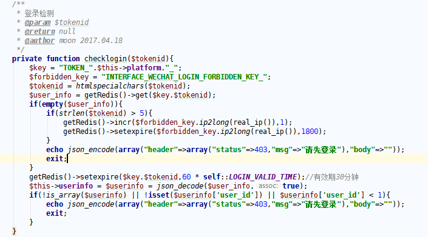

# 用户登录场景

- 登录给用户生成一个不重复的字符串tokenid

```shell
 假如值为： dd9b7511874889f4192fbda3d8b0881c

redis存一个
key=前缀（自定义）+"_"+dd9b7511874889f4192fbda3d8b0881c
value=json  {
  "user_id": 598,
  "mobile_phone": "",
  "openid": "oGrf0v4ov5ETTCNtW_A-Zq61kgsI"
}
```

- tokenid 是登录时候返回给客户端的，以后客户端每次调接口都需要带参数 tokenid
- 有tokenid 就能从redis里面获取用户需要初始化的内容
- 1800秒过期，期间用户调用了接口我们有重置为1800，只要用户30分钟没有调用接口，redis就过期，返回重新登录
- 客户端调接口传递tokenid，根据前缀_tokenid,获取了value

```shell
/**
 * Created by Administrator on 2016-11-30.
 */
var redis = require('redis');
//var Promise = require('promise');
var genericPool = require('generic-pool');
//var DbDriver = require('some-db-driver');
var HOST = '1.1.1.10';
var PORT = 6379;

const factory = {
    name : 'redis',
    create: function(){
        return new Promise(function(resolve, reject){
            var client = redis.createClient(PORT,HOST,{
                "host": "1.1.1.10",
                "port": 6379,
                "auth_pass": "222222"
            });
            client.on("error", function (err) {
                console.log("Error " + err);
            });
            client.on('connect', function(){
                console.log('create one')
                resolve(client)
            })
        })
    },
    destroy: function(client){
        return new Promise(function(resolve){
            client.on('end', function(){
                resolve()
            })
            client.disconnect()
        })
    }
}

var opts = {
    max: 10, // maximum size of the pool
    min: 2, // minimum size of the pool
    idleTimeoutMillis : 30000,
    log : false
}

var myPool = genericPool.createPool(factory, opts)

const resourcePromise = myPool.acquire()

resourcePromise.then(function(client) {
    client.select(0, function(err, data) {
        if (err) {
            conosle.log(err);
            myPool.release(client);
        } else {
            client.get('wechat:yg:access_token',function(err,data){
                if (err) {
                    console.log(err)
                } else {
                    console.log(data);
                }
                myPool.release(client);
            })
        }

    });
}).catch(function(err){
    console.log(err);
});

myPool.drain(function() {
    myPool.clear();
});
```

php 调用redis



> 前后端分离，所有的静态数据静态加载，动态数据都调用接口。调用接口获取用户的所有信息。调用接口  传递tokenid，后端通过 tokenid 找到登录用户，然后获取需要的信息，接口返回，前端拿到接口返回  进行渲染页面

# 应用场景

秒杀

设置锁之类的。比如下单，支付有前端回调，还有微信回调，都能影响这个订单结果对吧。那么就需要锁了。


